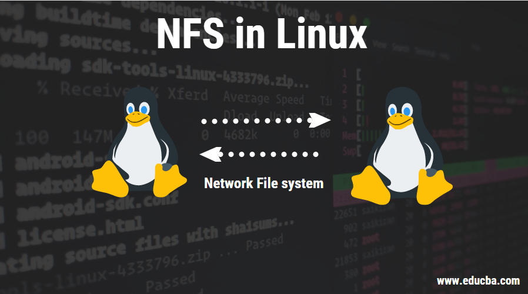

# NFS (Network File System)

Bem-vindo à Wiki de Instalação e Configuração do NFS no Ubuntu! Este guia abrangente foi criado para ajudá-lo a instalar e configurar o Network File System (NFS) em sistemas operacionais Ubuntu, tanto para servidores quanto para clientes. O NFS é uma solução poderosa para compartilhar arquivos entre computadores em uma rede local, permitindo que diferentes sistemas acessem e modifiquem arquivos de maneira colaborativa e eficiente.

👉 Acesse a [Wiki](https://github.com/IsraelJorge/nfs/wiki) para mais detalhes

## Objetivo

O principal objetivo desta Wiki é fornecer todas as instruções necessárias para a montagem e operação de duas NFS: um servidor e um cliente. Através deste guia, você aprenderá a instalar os softwares essenciais, configurar os sistemas adequadamente e realizar a análise dos dados obtidos.

## Estrutura

A Wiki está estruturada da seguinte forma:

1. **Hardware Utilizado**: Especificações do hardware do servidor e cliente.
2. **Configuração do Servidor NFS**: Instruções detalhadas sobre como configurar o servidor NFS, incluindo a exportação de diretórios e permissões de acesso.
3. **Configuração do Cliente NFS**: Passos para configurar o cliente NFS, montar os diretórios exportados pelo servidor e garantir a conectividade.
4. **Testes e Verificações**: Procedimentos para testar a configuração do NFS e verificar se o sistema está funcionando corretamente.
5. **Análise de Dados**: Métodos e ferramentas para a análise dos dados compartilhados através do NFS.

Esperamos que esta Wiki forneça todas as informações e orientações necessárias para que você possa configurar e utilizar o NFS no Ubuntu de forma eficaz. Se você encontrar qualquer dificuldade ou tiver dúvidas, não hesite em consultar as seções de ajuda ou entrar em contato com a equipe de suporte.

Boa sorte e feliz compartilhamento de arquivos 🚀!
